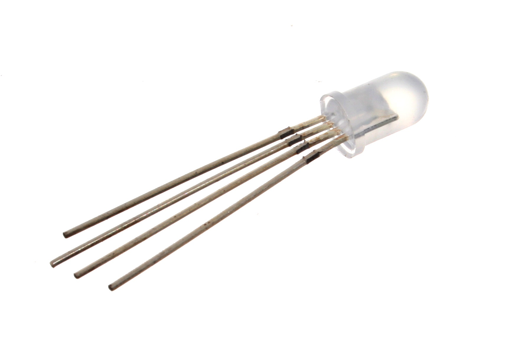
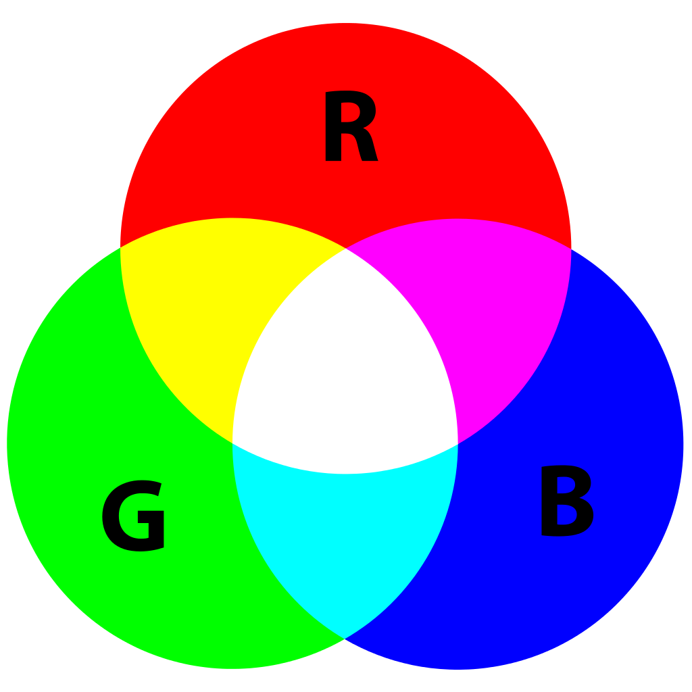
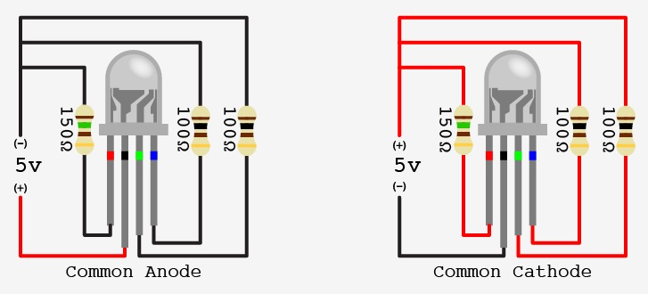

# Step 5: Controlling color 

We've covered all the basics and got the core of our circuit built. Now it's time to start making our connected product: an ambient weather visualisation. 

Right now, we've got an LED in our circuit. But its only a single color and that's not ideal. The good news is that the Particle Photon has an in-built RGB led that's controlable.

We're going to use this _full color LED_ as the main feedback for our ambient weather viz! 

Oh and you might have wondered about the __ping-pong ball in your kits__. Try popping it over the LED on your Photon - you'll find it diffuses the light really nicely. 



## RGB LEDs

An ordinary LED has one light emitting component, _RGB LEDs have three_ - one which emits __red__ light (R) , one for __green__ light (G) and one for __blue__ (B). It works much like a pixel on your computer screen these three components combine to give us color. We can control their brightness separately to mix colors. For example, by turning on the Red and Green component we can yellow light while turning on the red and blue components we can get magenta. 



## Wiring an RGB LED



RGB LED’s have four pins, one for each color and either a common anode (+, 3V3) pin or a common cathode pin (-, GND).  RGB LEDs are wired as illustrated in the diagram above. 

The longest terminal (leg) will be the common anode or cathode. 

With the anode/cathode nearest the left side, the left most terminal (leg) will be the RED terminal.

The right-most terminal will be BLUE, and the second from the right will be Green.

Each of the color terminals should be connected to a 1K Ohm resistor (brown, black, red) and then on to a PWM pin. 





## RGB LED Circuit

Make some changes to the circuit and add in the RGB LED: 

- The longest leg should be closest to the left hand side. Wire this to power (3V3)
- Connect the left terminal (Red component) to D0. Use a 220 Ohm Resistor to protect the LED.
- Connect the right terminal (Blue component) to D2. Use a 220 Ohm Resistor to protect the LED.
- Connect the remaining terminal (Green component) to D1. Use a 220 Ohm Resistor to protect the LED.


## Code


Use the LED code from Step 1 as a starting point for this sketch. The [completed code](code-by-end/LED.ino) is available in the folder above.

We'll start by adding three variables to the top of our code for each R,G and B component; also add some variables to store the current RGB values;

````
int redPin = D0;    // RED pin of the LED to PWM pin **A0**
int greenPin = D1;  // GREEN pin of the LED to PWM pin **D0**
int bluePin = D2;   // BLUE pin of the LED to PWM pin **D1**
int redValue = 255; // Full brightness for an ANODE RGB LED is 0, and off 255
int greenValue = 255; // Full brightness for an ANODE RGB LED is 0, and off 255
int blueValue = 255; // Full brightness for an ANODE RGB LED is 0, and off 255</td>
````

Then, start with an empty loop like so

````
void loop(){

}
````
__Note__ You might need to delete the existing loop because you can't have two in the same sketch!

Then add a simple function to set the RGB Values

````
void setRGBColor( int r, int g, int b ){
  analogWrite(redPin, 255 - redValue);
  analogWrite(greenPin, 255 - greenValue);
  analogWrite(bluePin, 255 - blueValue);
}
````

Now, modify the loop and experiment with making colors with our RGB LED. Add this to your loop

````
    setRGBColor( 255,255,255);    // set it to white
		delay( 2000);						// wait 2 seconds
    setRGBColor( 255,0,0);    // set it to red
		delay( 2000);						// wait 2 seconds
    setRGBColor( 255,255,0);    // set it to yellow
		delay( 2000);						// wait 2 seconds
    setRGBColor( 255,127,0);    // set it to orange
		delay( 2000);						// wait 2 seconds
    setRGBColor( 255,0,255);    // set it to magenta
		delay( 2000);						// wait 2 seconds
    setRGBColor( 0,255,0);    // set it to green
		delay( 2000);						// wait 2 seconds
    setRGBColor( 0,255,0);    // set it to green
		delay( 2000);						// wait 2 seconds
````

Once you've made those changes, __save and flash your code__ (hit the lighting!) Don't forget to pop on your ping pong ball!


### Try it yourself

Experiment with these colors - they can be any where from 0 - 255 for each component. Try out a few variations 


